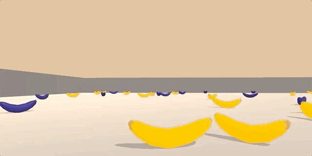
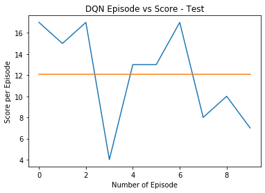

# Deep Reinforcement Learning Nanodegree

## Navigation - Train an RL Agent to Collect Bananas

Environment consist of a large square world in which agents target is to navigate to collect bananas (reward). A reward of **+1** is provided for collecting a **yellow banana**, and a reward of **-1** is provided for collecting a **blue banana**. The goal of our agent is to collect as many yellow bananas as possible while avoiding blue bananas. 

To solve the environment, agent must achieve an **average score of +13 over 100 consecutive episodes**.



### Evaluate State & Action Space

The state space has 37 dimensions and contains the agent's velocity, along with ray-based perception of objects around the agent's forward direction. Given this information, the agent has to learn how to best select actions. Four discrete actions are available:

- `0` move forward
- `1` move backward
- `2` turn left
- `3` turn right

### Getting Started

Download the environment from one of the links below.  You need only select the environment that matches your operating system:

- Linux: [click here](https://s3-us-west-1.amazonaws.com/udacity-drlnd/P1/Banana/Banana_Linux.zip)
- Mac OSX: [click here](https://s3-us-west-1.amazonaws.com/udacity-drlnd/P1/Banana/Banana.app.zip)
- Windows (64-bit): [click here](https://s3-us-west-1.amazonaws.com/udacity-drlnd/P1/Banana/Banana_Windows_x86_64.zip)

Install the python with the required virtual environment to execute the jupyter notebook using `requirement.txt`.

Follow the instructions in `Navigation.ipynb` to get started with training or execution of the trained agent.

###  Algorithm - Deep Q Learning

Agents use a policy to decide which actions to take within an environment. The primary objective of the learning algorithm is to find an optimal policy&mdash;i.e., a policy that maximizes the reward for the agent.

The agent "learns" the policy through a process of trial-and-error that iteratively maps various environment states to the actions that yield the highest reward.

Implementation of the algorithm can be seen in file `model.py` which contain three major part of Deep Q Learning as mentioned below:

- Feed forward neural network - To learn no-linear optimal policy function which maximize reward.
- 𝛆-greedy algorithm - To systematically manage the exploration vs. exploitation trade-off.
- Experience replay - To randomly sample data, so that the it become uncorrelated.

### Implementation Result

After various trial-and-error of hypyerparametes (hidden layers, buffer size, gamma, learning rate, and other) simple model with single hidden layer with 64 unit. worked well; which is simple, clean and understandable. 

```python
# hyperparametes
BUFFER_SIZE = int(1e5)  # replay buffer size
BATCH_SIZE = 64         # minibatch size
GAMMA = 0.99            # discount factor
TAU = 1e-3              # for soft update of target parameters
LR = 5e-4               # learning rate
UPDATE_EVERY = 4        # how often to update the network
HIDDEN_UNIT = 64        # number of units in hidden layer
```

-episode-vs-score.png)

Agent were able to solve the environment is 394 steps with and average reward of 13+ over 100 consecutive episodes. Test result of the agent on fresh environment for 10 episode is shown below.




### Future Improvements

This is start and there is plenty of space for improvement as we can see from the training/test result and few other things which i noticed in unity environment simulation during training of the agent.

- Clearly as we can see that training is not stable from the reward plot; mean reward is incressing but range of reward is not decresing. 
- Training time ie number of episode can be reduced I bet it can be solved around 200-300 episode with more complex network and hypyerparametes.
- Using priority buffer can also help in the converging the neural network faster with more stable training.

I noticed multiple times agent get stuck between wall and blue bananas and then episode ends, which get me thinking that agent has still not learned that it is okay to move forward sometime with negative reward then being stuck in one place and get low reward.
